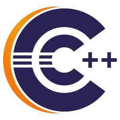

# Eclipse CDT™ C/C++ Development Tools

The Eclipse CDT™ Project provides a fully functional C and C++ Integrated Development Environment based on the Eclipse platform. Features include: support for project creation and managed build for various toolchains, standard make build, source navigation, various source knowledge tools, such as type hierarchy, call graph, include browser, macro definition browser, code editor with syntax highlighting, folding and hyperlink navigation, source code refactoring and code generation, visual debugging tools, including memory, registers, and disassembly viewers.

Please visit the [main CDT repo](https://github.com/eclipse-cdt/cdt) to file issues, get the code, or learn more about the project.

